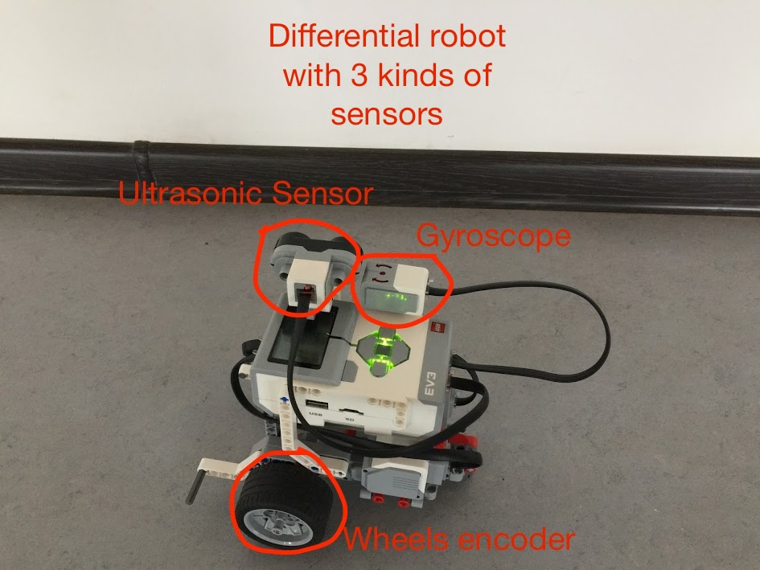
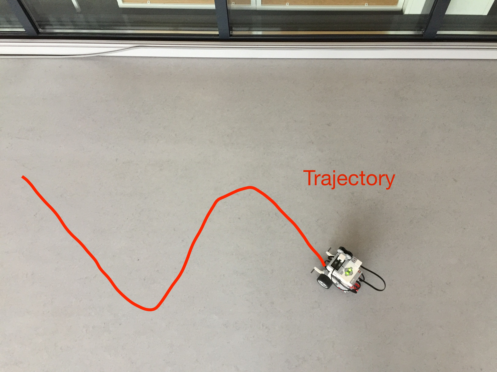
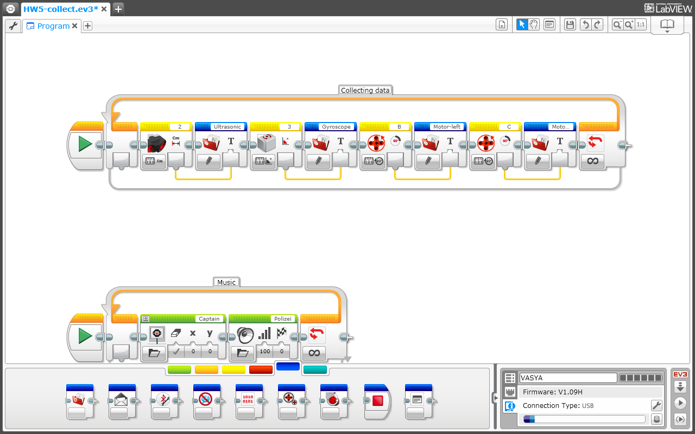
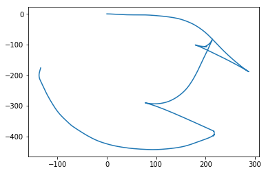
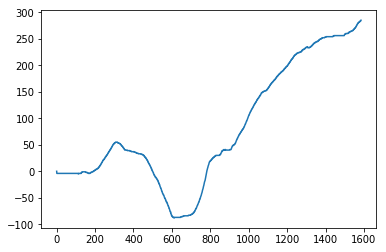

# kalman-filter
Hometask 5 from SIS course.
This repo contains:
- data for testing Kalman Filters, collected in two ways
- explanation how good data was collected
- trajectory extraction example and some operations on this data
###### You can use this data for your own Kalman filter implementation.

### 1. Choose a partner and write down his name
My partner is Oleg Bulichev. 

### 2. Construct lego robot, set trajectory of moving and collect indirect data from sensors
###### This data is in _Data-good_ folder
I use standart Differential robot structure from Lego Mindstorms EV3.
I use 3 kind of sensors:
- Wheel encoders
- Gyroscpe
- Ultrasonic sensor

How is it possible to use Ultrasonic sensor in this task? I run the robot near the wall, so robot all the time was pointed with ultrasonic at the wall, so it is possible to extract one of the coordinates from the combination of ultrasoinic and rotation angle.

To collect the data I used standard Lego Software. I coded this Sine-looking trajectory in it and run code with recording of the all sensors information.

### 3. Give your sensors data to your partner
###### This data is in _Data-good_ folder
- Gyroscope.txt is turning position in degrees
- Ultrasonic.txt is distance from the wall in centimeters
- Motor-Left and -Right.txt is wheels rotations in degrees.

Robot dimensions:
- R = 27 mm — radius of the wheels
- B = 100 mm — wheelspan

### 4. Try to guess your partner’s robot trajectory
#####  Try all algorithms that can be applied in your case (KF, EKF, UKF, PF)
I extract the data from _Dich_ dataset. Below you see the trajectory, that was recorded by my partner. Robot starts at (0,0) point.

Rotation of the robot during the movement is the following:

_See the more detailed explanation in trajectory-extraction notebook._
